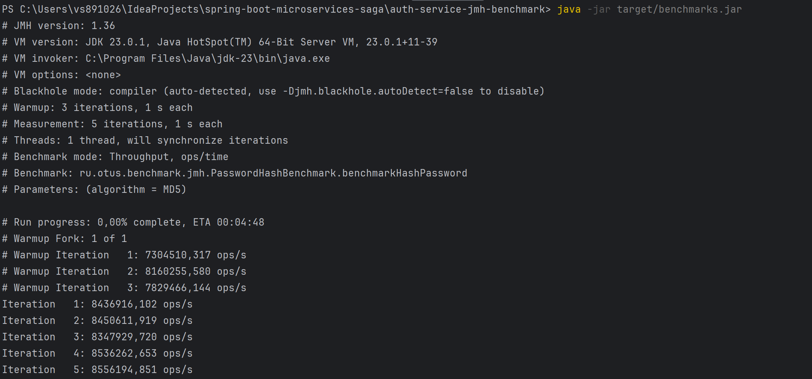

## Реализация benchmark для алгоритма хеширования

```console 
mvn clean package
```

```console 
java -jar target/auth-service-jmh-benchmark-0.0.1-SNAPSHOT.jar
```


Результаты:


Throughput (операций в секунду):

- MD5: примерно 4,99×10^6 ops/s
- SHA-256: примерно 5,02×10^6 ops/s
- SHA-512: примерно 2,15×10^6 ops/s (самый медленный)

Average Time (среднее время на операцию):

- MD5 и SHA-256 – примерно 10^-7 секунд на операцию
- SHA-512 – примерно 10^-6 секунд на операцию
Это подтверждает, что на каждый вызов хеширования SHA-512 тратит около 10 раз больше времени, чем MD5 и SHA-256.

Single Shot Time:
В режиме single shot (ss) для всех алгоритмов время исполнения оценивается примерно как 10^-4 секунд на операцию.

## JMHSample_30_Interrupts


Время выполнения операций put и take практически одинаково.

## JMHSample_27_Params


Для больших значений параметра "arg" увеличение "certainty" приводит
к значительному увеличению затрачиваемого времени.

## JMHSample_18_Control


Обмен между потоками в модели "ping-pong" происходит симметрично –
каждая из сторон (ping и pong) выполняет примерно 18,5 млн операций в секунду,
что в сумме даёт около 37 млн оп/с. Симметрия результатов подтверждает,
что реализация обмена сигналами и синхронизация между потоками работают корректно.

## Цель: Реализовать тесты по замеру производительности с помощью JMH

## Описание/Пошаговая инструкция выполнения домашнего задания:

1. Использовать приложение из предыдущих заданий.
Для выполнения задания потребуется сервис регистрации пользователя, реализованный ранее.
2. Добавить в сервис регистрации логику по хешированию пароля с 
последующим сохранением хеша в БД
3. Реализовать несколько тестов по производительности:
- тест на логику хэширвования пароля с применением 3 разных алгоритмов:
Md5, sha256, sha512 (возможно, в качестве параметра использовать число итераций) 
чтобы была сравнительная статистика. Чтобы обоснованно выбрать для сервиса менее
тяжелый вариант 
* тест на общий сервис регистрации клиента (без учёта инициализации spring, траспорта http rest)
4. Замерить все доступные в JMH метрики: Throughput, AverageTime, SampleTime, SingleShotTime
5. Выбрать 3 различых теста от https://hg.openjdk.org/code-tools/jmh/file/tip/jmh-samples/src/main/java/org/openjdk/jmh/samples/ и предоставить отчёт о запуске этих тестов.