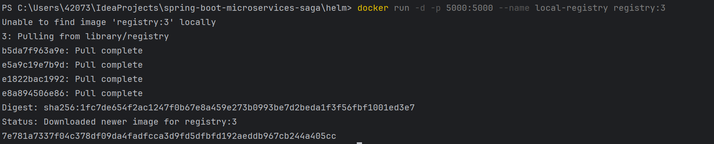
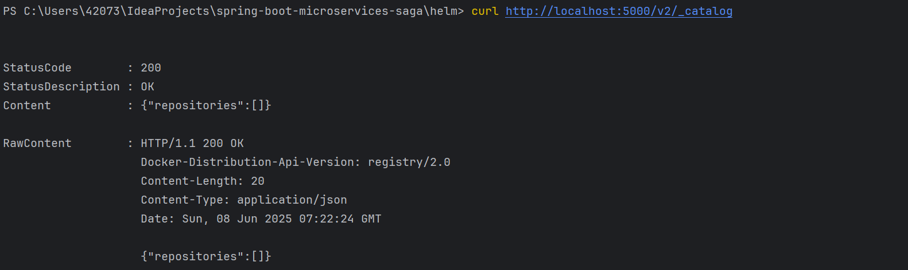
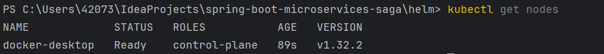

# HELM

* создаем локальный docker registry:

```shell
docker run -d -p 5000:5000 --name local-registry registry:3
```


* добавляем insecure-registries в конфиг
  "insecure-registries": ["localhost:5000"]

* проверяем registry
```shell
  curl http://localhost:5000/v2/_catalog
```


* Проверяем доступность локального кластера:

```shell
kubectl get nodes
```


* делаем деплой сервиса auth-service (для остальных сервисов такой же скрипт лежит в соответсвующей папке)
* переходим сначало в git bash консоль
```shell
cd helm
./auth-service/deploy.sh
```

* смотрим есть ли под
```shell
kubectl get pods -n microservices

```
* Смотрим внешний ip
```shell
kubectl get svc -n microservices
```

* делаем port forward
```shell
kubectl port-forward svc/auth-service-chart 8090:8090 -n microservices
```

* Выполянем запросы , смотрим логи kubernetes


* удаление сервиса
```shell
helm uninstall auth-service -n microservices
```